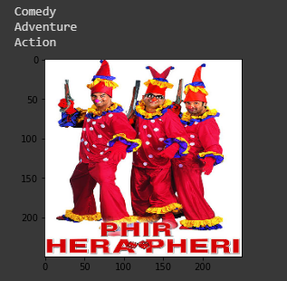
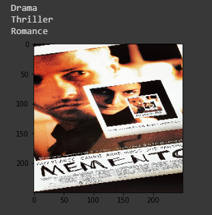
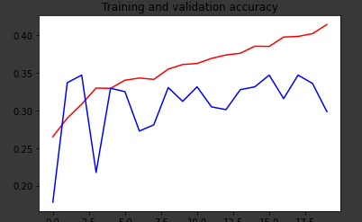
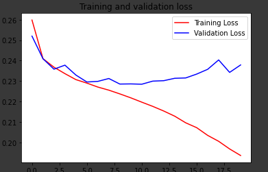
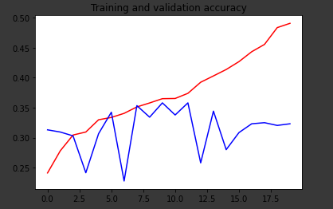
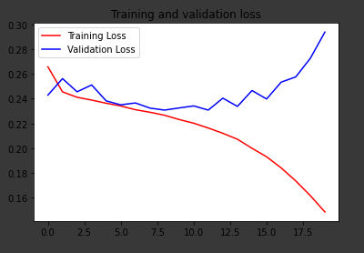

# Movie-Genre-Identification-From-Posters

A Multi-Label Image classification task to find Genre of a Movie from its Poster. For this task, Customised CNN Model, AlexNet and Pre-Trained ResNet Model yielded reasonable accuracy.

### Directory Structure

This Directory contains Following Files

1. **Notebook** - This folder contains one .ipynb Notebook for Genre Identification. The notebook Includes all experimentation details.

2. **Graphs** - This Folder contains Screenshots of Loss and Acuuracy Graphs for different architectures.

3. **Working** - This Folder Contains Screenshots of Sample movie posters given as Input and the predicted Genre.

#### Result Summary

| Architecture               | Test Accuracy     |
| -------------              |:-----------------:|
| Customized_CNN             |  0.3471           |
| AlexNet                    |  0.3581           |
| VGG-16                     |  0.1901           |
| Pre-Trained ResNet         |**0.3921**           |

### Sample Results

### Sample Graphs

### Cutomized CNN

### AlexNet

